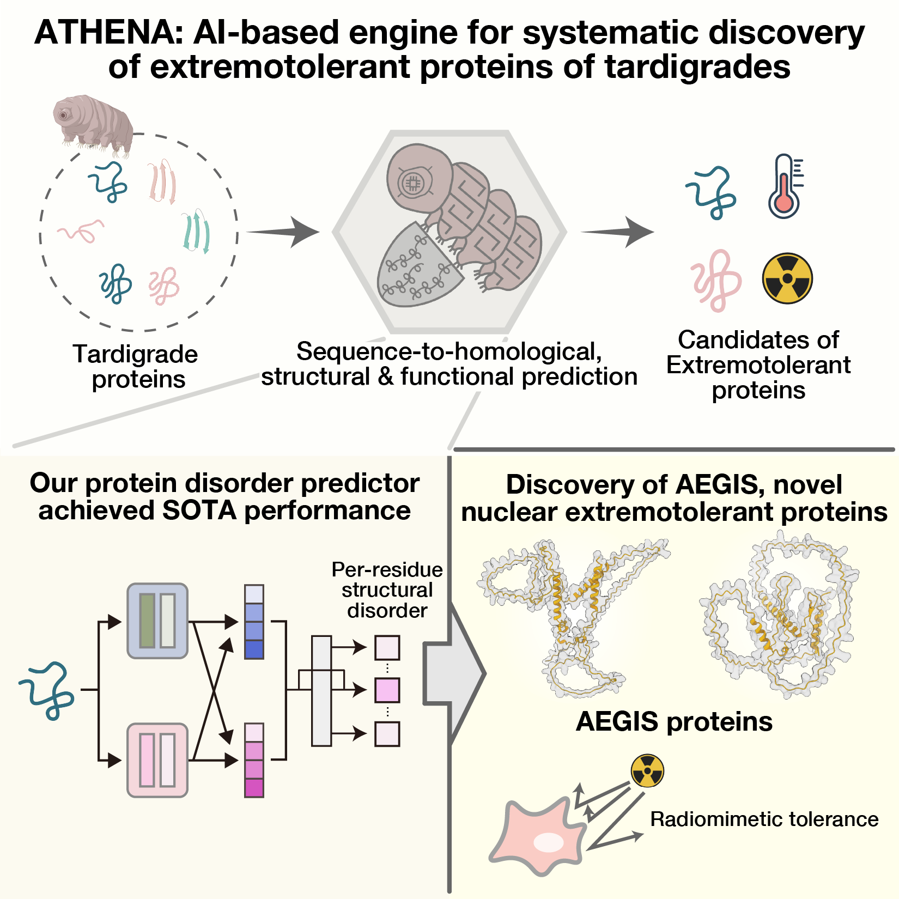

# ATHENA

This repository provides the official implementation for the core structural disorder prediction components of the ATHENA (AI-driven Tardigrade resistome High-throughput Exploration and Novel Annotation) framework. ATHENA is an integrated AI framework engineered to predict a protein's 'stress-resistance potential' directly from its primary sequence.



While the full ATHENA framework is designed to predict multiple properties, its primary function and core component is the accurate prediction of structural disorder—a key feature of many stress-response proteins (e.g., tardigrade effectors). This repository provides the two-tiered classification system for this task:

1.  A state-of-the-art residue-level classifier for mapping intrinsically disordered regions (IDRs).
2.  A protein-level classifier for predicting the likelihood of being globally disordered.


## Overview

The discovery of novel 'guardian' proteins, such as those that give tardigrades their remarkable resilience to extreme environments, is a significant challenge. Many of these key effectors are intrinsically disordered proteins (IDPs). Unlike structured proteins, IDPs lack a stable 3D fold, and their sequences often evolve rapidly. This makes them difficult to identify using traditional homology-based computational methods, which rely on sequence or structure conservation.

To overcome this challenge, we developed the ATHENA framework. The models provided here are focused on identifying structural disorder by capturing the subtle sequence features indicative of this property. The models are built upon protein language model (PLM) embeddings (ESM-C) and are fine-tuned using Low-Rank Adaptation (LoRA) to specialize in this complex prediction task.

## Key Features

This repository provides two distinct, state-of-the-art models:

* **Residue-Level IDR Classifier:**
    * Provides fine-grained prediction, mapping the precise boundaries of intrinsically disordered regions (IDRs) within a protein sequence.
    * Employs a dual-stream fusion architecture, combining **ESM-C** protein language model embeddings with **Boltz-2** structure prediction features.
    * Uses **Bilinear Cross-Attention** between the sequence and structure streams, with **Bi-directional GRU (BiGRU)** blocks for local context and an **MLP** classification head.

* **Protein-Level IDP Classifier:**
    * Predicts a protein's overall 'stress-resistance potential' (the **ATHENA score**), which correlates with its likelihood of being a globally disordered protein.
    * Built on embeddings from the **ESM-C** Protein Language Model (PLM).
    * Uses **Low-Rank Adaptation (LoRA)** fine-tuning to specialize the PLM for accurately distinguishing disordered from structured proteins.

## Prerequisites
The basic requirements for running ATHENA is Python with the following packages:

* python=3.10.16
* torch==2.5.1
* scikit-learn==1.6.1
* scipy==1.15.2
* pandas==2.2.3
* numpy==2.0.1
* esm==3.2.0
* transformers==4.48.1

Details on system requirements and the full dependency list is contained in the following file: environment.yml

## Installation

**Clone this repository:**
```
git clone https://github.com/shimizu-team/ATHENA.git
cd ATHENA
```
**Construct environment:**
You can set up the required environment using the environment.yml file:
```
conda env create -f environment.yml
conda activate ATHENA
```
Typical install time on a standard desktop computer: 3-5 minutes

## Usage

### Input Files

The primary input for both classifiers is a standard multi-FASTA file (e.g., `example_sequences.fasta`). The parsers in the scripts are designed to extract sequence IDs from UniProt-style headers (like `>sp|P12345|...`) or simple headers (like `>my_protein_id_1`).

**Example FASTA (`input/example_sequences.fasta`):**
```fasta
>sp|P0DTC2|SPIKE_SARS2
MFVFLVLLPLVSSQCVNLTTRTQLPPAYTNSFTRGVYYPDKVFRSSVLHSTQDLFLPFFSNVTWFHAIHV
SGTNGTKRFDNPVLPFNDGVYFASTEKSNIIRGWIFGTTLDSKTQSLLIVNNATNVVIKVCEFQFCNDPF
...
>my_protein_id_1
MSKGEELFTGVVPILVELDGDVNGHKFSVSGEGEGDATYGKLTLKFICTTGKLPVPWPTLVT
TLSYGVQCFSRYPDHMKQHDFFKSAMPEGYVQERTIFFKDDGNYKTRAEVKFEGDTLVNRIELKGIDFKED
...
```

### How to Run:

**1. Residue-Level Classification (Mapping IDRs)**

Expected run time for demo on a standard desktop computer: Anywhere from 1-10 minutes, depending on the number of sequences to be classified.

The IDR classifier requires three inputs with **matching protein IDs** across all of them:

1. **FASTA file** — standard format (`>PROTEIN_ID\nSEQUENCE`)
2. **ESM-C embeddings** — a `.pt` file containing a dict of `{protein_id: tensor[L, 960]}` (must use ESM-C **300m**)
3. **Boltz-2 features** — a directory of per-protein subdirectories containing structure prediction outputs

Run inference using the `predict.py` script inside `ATHENA_IDR_Classifier/`:

```
cd ATHENA_IDR_Classifier

python predict.py \
    --fasta data/example_sequences.fasta \
    --embeddings data/embeddings/example_esmc_300m.pt \
    --boltz-dir data/boltz2_predictions/predictions \
    --output-dir output/
```

To predict specific proteins only:

```
python predict.py \
    --fasta data/example_sequences.fasta \
    --embeddings data/embeddings/example_esmc_300m.pt \
    --boltz-dir data/boltz2_predictions/predictions \
    --protein-ids DP03748 DP03749 \
    --output-dir output/
```

**Command-Line Options:**

| Option | Default | Description |
|--------|---------|-------------|
| `--fasta` | (required) | FASTA file with query sequences |
| `--embeddings` | (required) | Pre-computed ESM-C embeddings `.pt` file |
| `--boltz-dir` | (required) | Boltz-2 predictions directory |
| `--checkpoint` | `weights/best_model.pt` | Model checkpoint path |
| `--protein-ids` | all | Specific protein IDs to predict |
| `--output-dir` | `./output` | Output directory |
| `--batch-size` | 8 | Inference batch size |
| `--threshold` | auto (0.4302) | Classification threshold |
| `--format` | both | Output format: json, tsv, or both |

**Preparing inputs for your own proteins:**

To run predictions on new proteins, you need to pre-compute both ESM-C embeddings and Boltz-2 features.

**2. Protein-Level IDP Classification**
Expected run time for demo on a standard desktop computer: Anywhere from 1-10 minutes, depending on the number of sequences to be scored.
```
python ATHENA_IDP_classification.py --title "IDP_Inference" \
                    --adapter_paths "IDP_LoRA=model_params" \
                    --classifier_params_path "model_params" \
                    --output_type "before_softmax" \
                    --batch_size 64 \
                    --fasta_path "input/example_sequences.fasta"
```
This script executes ATHENA_IDP_classification.py with specific arguments:

* **--fasta_path** "input/example_sequences.fasta": Specifies your input FASTA file.

* **--adapter_paths** "IDP_LoRA=model_params": Loads the LoRA adapter weights. This tells the script to look in the model_params/ directory for the adapter files (like adapter_model.safetensors) and load them with the name "IDP_LoRA".

* **-classifier_params_path** "model_params": Specifies the directory containing the weights for the final linear classifier head. The script will look for a file named classifier_params.pth inside this directory.

* **--output_type** "before_softmax": This is a key setting. It instructs the script to output the raw, unnormalized logit scores from the model instead of softmax probabilities. This raw score is the "ATHENA Score."

* **--batch_size** 64: Sets the batch size for inference. Adjust based on your GPU memory.

### Output Explanation

The two workflows produce different types of output files.

**1. Residue-Level Classifier Output**

Predictions are saved in both JSON and TSV formats in the specified `--output-dir`:

**JSON** (`predictions.json`):
```json
{
  "DP03748": {
    "length": 180,
    "threshold": 0.4302,
    "fraction_disordered": 0.15,
    "probabilities": [0.12, 0.87, ...],
    "predictions": [0, 1, ...]
  }
}
```

**TSV** (`predictions.tsv`):

| Column | Description |
| :--- | :--- |
| protein_id | The identifier for the protein (e.g., DP03748). |
| position | The 1-based index of the amino acid in the sequence. |
| amino_acid | The single-letter amino acid at that position. |
| probability | The predicted probability (0.0000 to 1.0000) of being disordered. |
| prediction | The hard prediction: 1 (Disordered) or 0 (Structured), based on the threshold. |

**2. Protein-Level Classifier Output**

The output depends on the --output_type argument set in inference.sh:

--output_type "before_softmax" (Recommended): This saves two PyTorch (.pt) files in the specified --output_dir (default is output/). These files are Python dictionaries mapping each seq_id to its raw logit score:

IDP_score_before_softmax_{title}.pt: This is the main "ATHENA Score." A higher score indicates a higher likelihood of being a disordered "guardian" protein.

Structured_score_before_softmax_{title}.pt: The raw logit score for the "structured" class.

--output_type "IDP_probability" (Default): This saves a single PyTorch (.pt) file:

IDP_score_{title}.pt: A dictionary mapping each seq_id to its softmax probability (a float between 0.0 and 1.0) of being in the "IDP" class.
