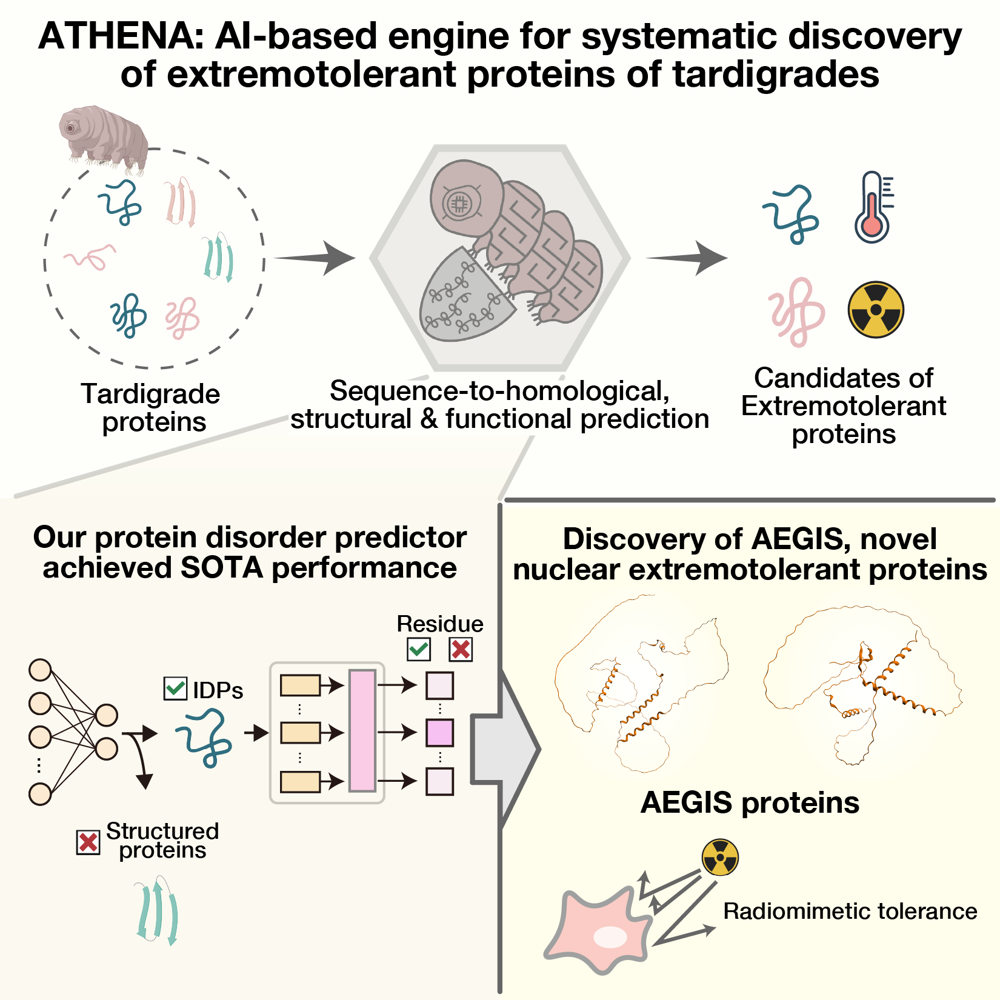

# ATHENA

This repository provides the official implementation for the core structural disorder prediction components of the ATHENA (AI-driven Tardigrade resistome High-throughput Exploration and Novel Annotation) framework. ATHENA is an integrated AI framework engineered to predict a protein's 'stress-resistance potential' directly from its primary sequence.

While the full ATHENA framework is designed to predict multiple properties, its primary function and core component is the accurate prediction of structural disorder—a key feature of many stress-response proteins (e.g., tardigrade effectors). This repository provides the two-tiered classification system for this task:

1. A protein-level classifier for predicting the likelihood of being globally disordered.
2. A state-of-the-art residue-level classifier for mapping intrinsically disordered regions (IDRs).

## Overview

The discovery of novel 'guardian' proteins, such as those that give tardigrades their remarkable resilience to extreme environments, is a significant challenge. Many of these key effectors are intrinsically disordered proteins (IDPs). Unlike structured proteins, IDPs lack a stable 3D fold, and their sequences often evolve rapidly. This makes them difficult to identify using traditional homology-based computational methods, which rely on sequence or structure conservation.

To overcome this challenge, we developed the ATHENA framework. The models provided here are focused on identifying structural disorder by capturing the subtle sequence features indicative of this property. The models are built upon protein language model (PLM) embeddings (ESM-C) and are fine-tuned using Low-Rank Adaptation (LoRA) to specialize in this complex prediction task.

## Key Features

This repository provides two distinct, state-of-the-art models:

* **Protein-Level IDP Classifier:**
    * Predicts a protein's overall 'stress-resistance potential' (the **ATHENA score**), which correlates with its likelihood of being a globally disordered protein.
    * Built on embeddings from the **ESM-C** Protein Language Model (PLM).
    * Uses **Low-Rank Adaptation (LoRA)** fine-tuning to specialize the PLM for accurately distinguishing disordered from structured proteins.

* **Residue-Level IDR Classifier:**
    * Provides fine-grained prediction, mapping the precise boundaries of intrinsically disordered regions (IDRs) within a protein sequence.
    * Employs a hybrid deep learning architecture, combining a **Bi-directional LSTM (Bi-LSTM)** to capture local sequence context and a **Transformer** encoder to model long-range dependencies.



## Prerequisites
The basic requirements for running ATHENA is Python with the following packages:

* python=3.10.16
* torch==2.5.1
* scikit-learn==1.6.1
* scipy==1.15.2
* pandas==2.2.3
* numpy==2.0.1
* esm==3.2.0
* transformers==4.48.1

Details on system requirements and the full dependency list is contained in the following file: environment.yml

## Installation

**Clone this repository:**
```
git clone https://github.com/shimizu-team/ATHENA.git
cd ATHENA
```
**Construct environment:**
You can set up the required environment using the environment.yml file:
```
conda env create -f environment.yml
conda activate ATHENA
```

## Usage

### Input Files

The primary input for both classifiers is a standard multi-FASTA file (e.g., `example_sequences.fasta`). The parsers in the scripts are designed to extract sequence IDs from UniProt-style headers (like `>sp|P12345|...`) or simple headers (like `>my_protein_id_1`).

**Example FASTA (`input/example_sequences.fasta`):**
```fasta
>sp|P0DTC2|SPIKE_SARS2
MFVFLVLLPLVSSQCVNLTTRTQLPPAYTNSFTRGVYYPDKVFRSSVLHSTQDLFLPFFSNVTWFHAIHV
SGTNGTKRFDNPVLPFNDGVYFASTEKSNIIRGWIFGTTLDSKTQSLLIVNNATNVVIKVCEFQFCNDPF
...
>my_protein_id_1
MSKGEELFTGVVPILVELDGDVNGHKFSVSGEGEGDATYGKLTLKFICTTGKLPVPWPTLVT
TLSYGVQCFSRYPDHMKQHDFFKSAMPEGYVQERTIFFKDDGNYKTRAEVKFEGDTLVNRIELKGIDFKED
...
```
### How to Run:
**1. Protein-Level IDP Classification**
```
python ATHENA_IDP_classification.py --title "IDP_Inference" \
                    --adapter_paths "IDP_LoRA=model_params" \
                    --classifier_params_path "model_params" \
                    --output_type "before_softmax" \
                    --batch_size 64 \
                    --fasta_path "input/example_sequences.fasta"
```
This script executes ATHENA_IDP_classification.py with specific arguments:

* **--fasta_path** "input/example_sequences.fasta": Specifies your input FASTA file.

* **--adapter_paths** "IDP_LoRA=model_params": Loads the LoRA adapter weights. This tells the script to look in the model_params/ directory for the adapter files (like adapter_model.safetensors) and load them with the name "IDP_LoRA".

* **-classifier_params_path** "model_params": Specifies the directory containing the weights for the final linear classifier head. The script will look for a file named classifier_params.pth inside this directory.

* **--output_type** "before_softmax": This is a key setting. It instructs the script to output the raw, unnormalized logit scores from the model instead of softmax probabilities. This raw score is the "ATHENA Score."

* **--batch_size** 64: Sets the batch size for inference. Adjust based on your GPU memory.

**2. Residue-Level Classification (Mapping IDRs)**

This workflow is an end-to-end pipeline that performs two steps:

Embedding Generation: It first generates residue-level embeddings for each protein in your FASTA file

IDR Prediction: It then feeds these embeddings into the IDR classification model to predict a disorder label (0 or 1) and probability for each residue.

Use the provided IDR_classification.sh script:

```
python ATHENA_IDR_classification.py \
    --fasta_file input/example_sequences.fasta \
    --idr_model_path ATHENA_IDR_model_params/ATHENA_IDR_Weights.pt \
    --output_csv IDR_predictions.csv \
    --esm_model_name "esmc_300m" 
```

* **--fasta_file** input/example_sequences.fasta: Specifies your input FASTA file.

* **--idr_model_path** ATHENA_IDR_model_params/ATHENA_IDR_Weights.pt: The path to the pre-trained weights for the Bi-LSTM+Transformer model. The script expects this file to contain a model_state_dict.

* **--output_csv** IDR_predictions.csv: The name of the final CSV file where all per-residue predictions will be saved.

* **--esm_model_name** "esmc_300m": The name of the ESM model to use for generating embeddings. If you use an API model like "esmc_300m", you must also provide the --esm_api_token argument with your API key.

* **--save_embeddings_dir** (Optional): If you add this argument (e.g., --save_embeddings_dir "my_embeddings"), the script will save the intermediate residue embeddings to disk, which can be useful for future runs.

### Output Explanation

The two workflows produce different types of output files.

**1. Protein-Level Classifier Output**

The output depends on the --output_type argument set in inference.sh:

--output_type "before_softmax" (Recommended): This saves two PyTorch (.pt) files in the specified --output_dir (default is output/). These files are Python dictionaries mapping each seq_id to its raw logit score:

IDP_score_before_softmax_{title}.pt: This is the main "ATHENA Score." A higher score indicates a higher likelihood of being a disordered "guardian" protein.

Structured_score_before_softmax_{title}.pt: The raw logit score for the "structured" class.

--output_type "IDP_probability" (Default): This saves a single PyTorch (.pt) file:

IDP_score_{title}.pt: A dictionary mapping each seq_id to its softmax probability (a float between 0.0 and 1.0) of being in the "IDP" class.

**2. Residue-Level Classifier Output**

This workflow produces a single, comprehensive CSV file specified by the --output_csv argument (e.g., IDR_predictions.csv).

The file contains one row for every amino acid in your input FASTA, with the following columns:

| Column | Description |
| :--- | :--- |
| Protein ID | The identifier for the protein (e.g., P0DTC2). |
| Residue Index | The 0-based index of the amino acid in the sequence. |
| Predicted Label | The hard prediction: 1 (Disordered) or 0 (Structured). |
| Disordered Probability | The softmax probability (0.0000 to 1.0000) for the "Disordered" class. |
